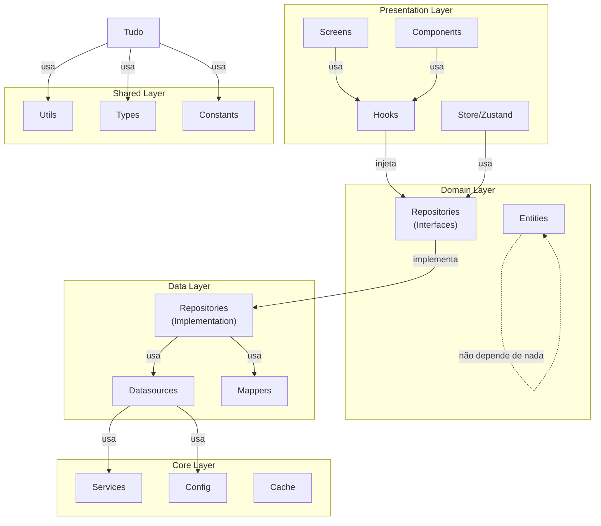

# 🏗️ Arquitetura Clean Architecture - ByteBank Mobile

## 📋 Visão Geral da Estrutura

O projeto foi reorganizado seguindo os princípios de **Clean Architecture**, mantendo as dependências em uma única direção e separando as responsabilidades em camadas bem definidas.

```
src/
├── presentation/          ← Camada de Apresentação (UI/Interação)
├── domain/               ← Camada de Negócio (Lógica pura)
├── data/                 ← Camada de Dados (Implementações)
├── core/                 ← Camada de Infraestrutura (Ferramentas)
└── shared/               ← Recursos Compartilhados
```

---

## 🎯 Camadas da Arquitetura

### 1. **Presentation Layer** (`src/presentation/`)
Responsável pela interface do usuário, navegação e estado local da UI.

```
presentation/
├── screens/          # Telas da aplicação
├── components/       # Componentes React reutilizáveis
├── hooks/           # Custom hooks para lógica de UI
├── navigation/      # Navegação da aplicação
├── store/           # Estado global (Zustand)
└── contexts/        # React Context API
```

**Dependências Permitidas:** domain, shared
**Não Importa De:** data (diretamente)

**Quando usar o quê:**
- **Screens**: Componentes full-page
- **Components**: Componentes reutilizáveis (Button, Card, Input)
- **Hooks**: Lógica compartilhada (useAuth, useTransactions)
- **Store**: Estado global com Zustand
- **Navigation**: Estrutura de navegação (Stack, Tab, Drawer)

---

### 2. **Domain Layer** (`src/domain/`)
Contém a lógica de negócio pura e abstrações.

```
domain/
├── entities/       # Modelos de negócio puros
└── repositories/   # Interfaces/contratos de dados
```

**Responsabilidades:**
- Definir entidades de negócio
- Definir contratos (interfaces) de repositórios
- Lógica de validação de negócio
- Use cases (se implementados)

**Regra Importante:** Não importa de nenhuma outra camada!

**Exemplo de Entidade:**
```typescript
// domain/entities/User.ts
export interface User {
  id: string;
  name: string;
  email: string;
  createdAt: Date;
}

// domain/entities/Transaction.ts
export interface Transaction {
  id: string;
  userId: string;
  amount: number;
  category: string;
  date: Date;
}
```

---

### 3. **Data Layer** (`src/data/`)
Implementa o acesso a dados e implementações de repositórios.

```
data/
├── datasources/    # Acesso a dados (Firebase, API, AsyncStorage)
├── models/         # DTOs e modelos de transferência
└── repositories/   # Implementações de repositórios (implements domain)
```

**Dependências Permitidas:** domain, shared
**Não Importa De:** presentation

**Responsabilidades:**
- Implementar repositórios abstratos do domain
- Mapear dados entre diferentes fontes
- DTOs (Data Transfer Objects)

**Exemplo:**
```typescript
// data/datasources/firebase-auth.datasource.ts
export class FirebaseAuthDatasource {
  async login(email: string, password: string) { ... }
  async register(user: RegisterDTO) { ... }
}

// data/repositories/auth.repository.ts
export class AuthRepository implements IAuthRepository {
  constructor(private datasource: FirebaseAuthDatasource) {}
  
  async login(email: string, password: string): Promise<User> {
    const dto = await this.datasource.login(email, password);
    return mapDTOToEntity(dto);
  }
}
```

---

### 4. **Core Layer** (`src/core/`)
Infraestrutura, configurações e serviços técnicos.

```
core/
├── cache/              # Sistema de cache (AsyncStorage)
├── services/           # Serviços técnicos (Firebase, RxJS)
└── infrastructure/
    ├── config/         # Configurações (Firebase, API)
    └── security/       # Segurança (tokens, criptografia)
```

**Responsabilidades:**
- Configurações de terceiros
- Serviços técnicos globais
- Cache e persistência
- Segurança

---

### 5. **Shared Layer** (`src/shared/`)
Recursos reutilizáveis por todas as camadas.

```
shared/
├── utils/       # Funções utilitárias (formatters, helpers)
├── types/       # Tipos TypeScript globais
└── constants/   # Constantes da aplicação
```

**Exemplo:**
```typescript
// shared/utils/formatters.ts
export const formatCurrency = (value: number) => { ... }
export const formatDate = (date: Date) => { ... }

// shared/constants/app.constants.ts
export const APP_NAME = 'ByteBank';
export const API_TIMEOUT = 30000;

// shared/types/index.ts
export type Theme = 'light' | 'dark';
```

---

## 🔄 Fluxo de Dados (Unidirecional)

```
presentation/
    ↓ (usa)
domain/ + shared/
    ↓ (implementa)
data/
    ↓ (usa)
core/ + shared/
```

**Exemplo Completo:**

1. **User clica em Login** → `LoginScreen` (presentation)
2. **LoginScreen chama hook** → `useAuth()` (presentation/hooks)
3. **Hook injeta repositório** → `IAuthRepository` (domain/repositories)
4. **Repositório executa** → `AuthRepository` (data/repositories)
5. **Repositório chama datasource** → `FirebaseAuthDatasource` (data/datasources)
6. **Datasource usa serviço** → `FirebaseAuth` (core/services)
7. **Mapeia DTO para Entity** → usando shared/utils se necessário
8. **Retorna User** → atualiza store (presentation/store)

---

## 📁 Estrutura de Pastas Detalhada

### Presentation/Screens
```
presentation/screens/
├── auth/
│   ├── LoginScreen/
│   │   └── LoginScreen.tsx
│   ├── RegisterScreen/
│   └── index.ts           # Exportações
├── home/
├── transactions/
└── index.ts               # Re-exportações de todas as screens
```

### Presentation/Components
```
presentation/components/
├── common/                # Componentes reutilizáveis
│   ├── Button/
│   ├── Card/
│   ├── Input/
│   └── index.ts
├── forms/                 # Componentes de formulário
├── layout/                # Componentes de layout
└── index.ts
```

### Data/Models
```
data/models/
├── auth/
│   ├── login.dto.ts
│   ├── register.dto.ts
│   └── user.model.ts
├── transaction/
└── user/
```

---

## 🚀 Padrões a Seguir

### 1. **Criar Nova Feature**

Crie as pastas necessárias em ordem:

1. `domain/entities/NewEntity.ts` - Defina a entidade
2. `domain/repositories/INewRepository.ts` - Defina o contrato
3. `data/models/NewModel.dto.ts` - Defina o DTO
4. `data/datasources/NewDatasource.ts` - Implemente acesso a dados
5. `data/repositories/NewRepository.ts` - Implemente repositório
6. `presentation/hooks/useNew.ts` - Crie o hook
7. `presentation/screens/NewScreen.tsx` - Crie a tela

### 2. **Importações Corretas**

✅ **Permitido:**
```typescript
// presentation/screens/MyScreen.tsx
import { useAuth } from '../hooks/useAuth';
import { Button } from '../components/common/Button';
import { formatCurrency } from '@shared/utils/formatters';
```

❌ **NÃO Permitido:**
```typescript
// presentation/screens/MyScreen.tsx
import { FirebaseAuthDatasource } from '@data/datasources/firebase';
import { AuthRepository } from '@data/repositories/auth';
```

### 3. **Nomenclatura**

| Tipo | Padrão | Exemplo |
|------|--------|---------|
| Interfaces | `I<Nome>` | `IAuthRepository` |
| Classes | `<Nome>` | `AuthRepository` |
| Componentes | `<Nome>` | `Button`, `LoginForm` |
| Hooks | `use<Nome>` | `useAuth()`, `useTransactions()` |
| DTOs | `<Nome>.dto` | `login.dto.ts` |
| Screens | `<Nome>Screen` | `LoginScreen`, `DashboardScreen` |

---

## 📊 Diagrama de Dependências



---

## 🔍 Checklist de Organização

- ✅ Pastas vazias e redundantes removidas
- ✅ Estrutura organizada em Clean Architecture
- ✅ Responsabilidades bem separadas
- ✅ Fluxo de dados unidirecional
- ✅ Sem importações circulares
- ⏳ Index.ts em cada pasta com exportações centralizadas
- ⏳ DTOs e mappers implementados conforme necessário
- ⏳ Interfaces de repositório definidas

---

## 📚 Próximos Passos

1. **Criar index.ts** em cada pasta para exportações centralizadas
2. **Separar lógica de UI** em componentes reutilizáveis
3. **Implementar padrão Repository** para acesso a dados
4. **Adicionar mappers** para conversão DTO ↔ Entity
5. **Documentar tipos de dados** em `shared/types/`

---

**Data de Atualização:** 11 de Fevereiro de 2026  
**Versão do Projeto:** 1.0.0 (Reorganizado)
